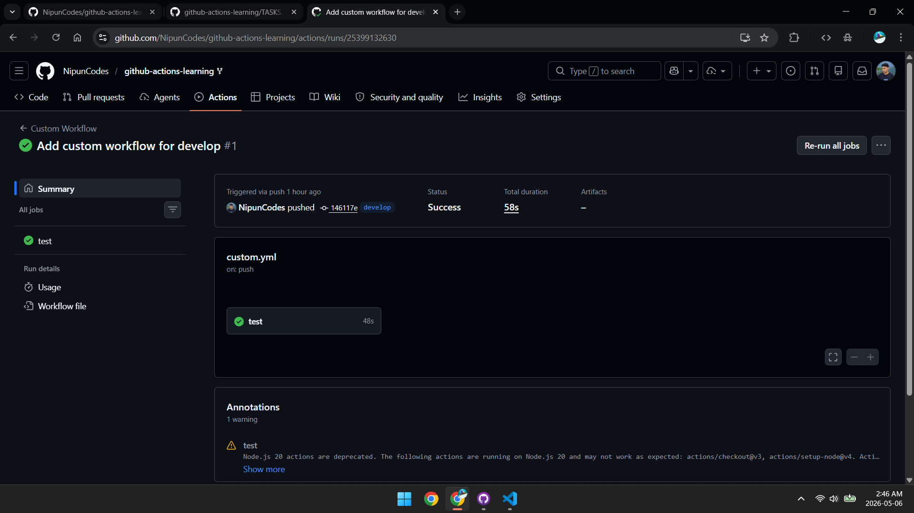
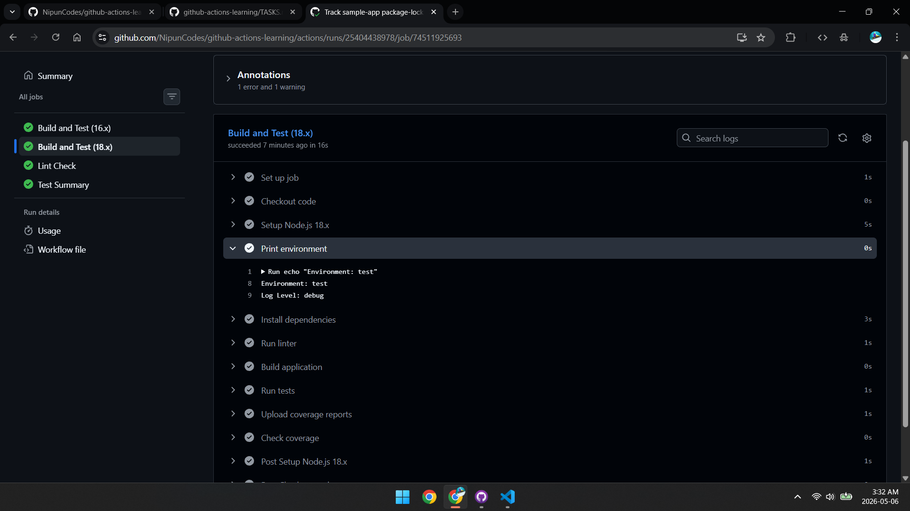
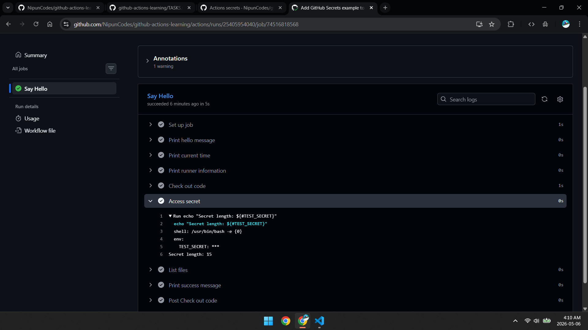
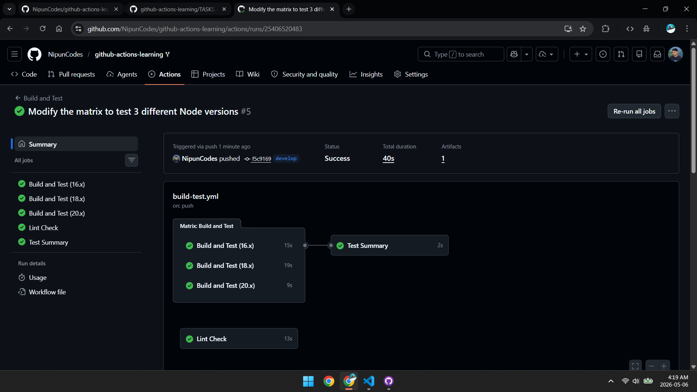

# Intermediate Badge Submission - Nipun

**Date:** May 6, 2026
**Status:** Submitted for Review

## Tasks Completed

- [ ] Task 4: Create a Custom Workflow
- [ ] Task 5: Add Environment Variables
- [ ] Task 6: Use GitHub Secrets
- [ ] Task 7: Matrix Testing

## Evidence

### Task 4: Custom workflow running on develop branch

Workflow file: .github/workflows/custom.yml

### Task 5: Environment variables displaying in logs

### Task 6: GitHub secrets access (masked in logs)

### Task 7: Matrix testing across 3 Node versions in parallel

## Notes

- Node version mismatch caused initial workflow failure; updated the workflow to use supported Node versions and reran successfully.
- package-lock.json mismatch after install; regenerated it with npm install and committed the updated lockfile.